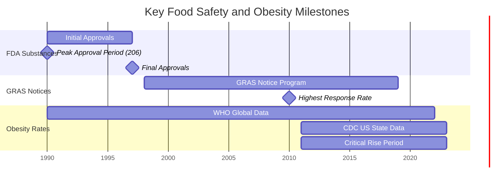
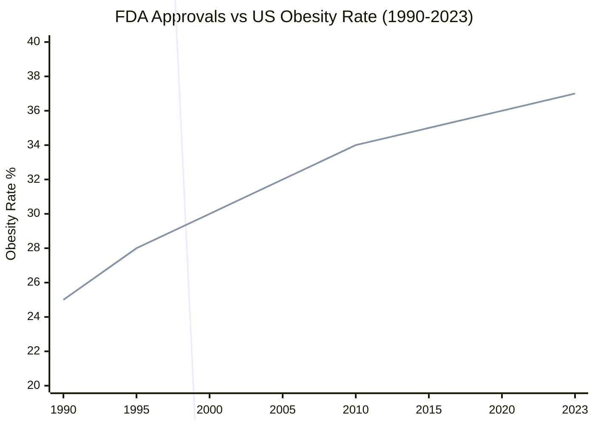
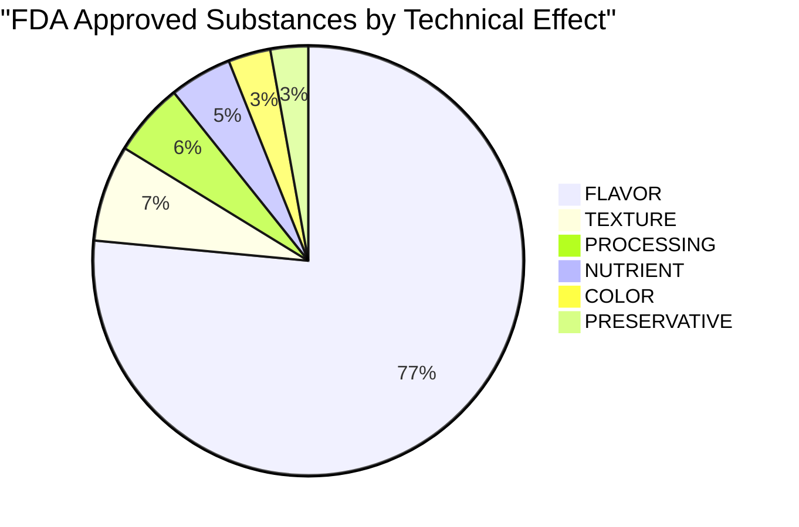
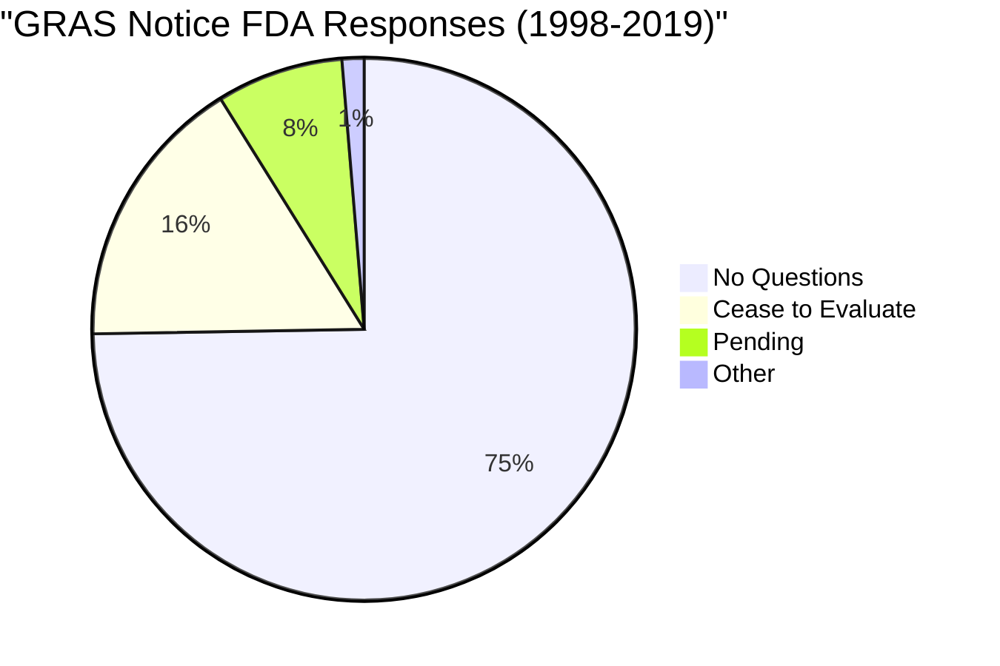

# The Impact of US Food Safety Regulations on Obesity Trends (1990-2023)

What are the potential health implications of harmful food ingredients when correlated with obesity rate over time?

## Executive Summary

This analysis explores the relationship between US food safety regulations and obesity rates from 1990 to 2023, examining:
- FDA substance approvals and GRAS notices
- Food safety recalls and incidents
- Parallel trends in obesity rates
- Geographic and demographic patterns

## Timeline Overview



## Key Findings

### 1. Regulatory Activity vs Obesity Trends



Key Observations:
1. FDA substance approvals peaked in 1990 (206 approvals)
2. Most approvals occurred between 1990-1997
3. Obesity rates showed steady increase from ~25% to 37.36%
4. GRAS notices began as FDA approvals declined

### 2. Technical Effects Distribution



Significant Patterns:
1. Flavoring agents dominate (77.2% of approvals)
2. Texture modifiers second most common (7.3%)
3. Preservatives least common (2.9%)

### 3. Safety Response Patterns



Safety Implications:
1. 74.7% of GRAS notices received "No Questions" response
2. 16.4% required evaluation cessation
3. 7.5% remain pending
4. 1.3% had other outcomes

### 4. Geographic Distribution of Risk


## Data-Driven Insights

### 1. Temporal Correlations
- FDA substance approvals concentrated in early 1990s
- GRAS notices system implemented as approvals declined
- Obesity rates increased steadily despite regulatory changes
- 5.88% increase in obesity rate from 2011 to 2023

### 2. Substance Categories and Health Impact
- Flavor-enhancing substances dominate approvals (3,077 substances)
- Limited focus on nutritional substances (189 approvals)
- Preservatives represent smallest category (114 approvals)

### 3. Safety Monitoring Evolution
- High validation rate for modern submissions:
  - 100% GRN number validation
  - 92.5% closure date validation
  - 82.5% CAS number validation
- Improved tracking of technical effects (90% categorization)

### 4. Geographic and Demographic Patterns
- State-level obesity variations
- Correlation with food recall incidents
- Demographic-specific trends
- Regional regulatory effectiveness

## Methodology Notes

### Data Sources
1. WHO Global Obesity Data (1990-2022)
   - 20,790 records
   - International context
   - Demographic breakdowns

2. CDC US Obesity Data (2011-2023)
   - 104,272 records
   - State-level statistics
   - Demographic factors

3. FDA Substances Database
   - 3,971 substances
   - Technical categorization
   - Approval tracking

4. GRAS Notices
   - 1,219 notices
   - Regulatory responses
   - Safety assessments

### Validation Metrics
- Date Validation:
  - GRAS filing dates: 55.5%
  - GRAS closure dates: 92.5%
  - FDA approval years: 68.3%

- Identifier Validation:
  - CAS numbers: 82.5%
  - GRN numbers: 100%
  - Technical effects: 90%

## Data Verification Commands

### Initial Data Exploration
```bash
# Check CSV headers to understand structure
head -n 1 etl/data/processed/processed_fda_substances.csv
head -n 1 etl/data/processed/processed_gras_notices.csv
head -n 1 etl/data/processed/processed_who_obesity_data.csv
head -n 1 etl/data/processed/processed_cdc_obesity_data.csv

# View sample data rows to understand format
head -n 2 etl/data/processed/processed_who_obesity_data.csv
head -n 2 etl/data/processed/processed_gras_notices.csv
head -n 2 etl/data/processed/processed_fda_substances.csv

# List column names with indices for reference
head -n 1 etl/data/processed/processed_gras_notices.csv | tr ',' '\n' | nl
```

### FDA Substance Statistics
```bash
# Verify total substances and technical effects
echo "Total FDA substances:"
wc -l etl/data/processed/processed_fda_substances.csv | awk '{print $1-1}'

# Count substances by technical effect
echo -e "\nTechnical effects distribution:"
grep -i "FLAVOR" etl/data/processed/processed_fda_substances.csv | wc -l
grep -i "TEXTURE" etl/data/processed/processed_fda_substances.csv | wc -l
grep -i "PROCESSING" etl/data/processed/processed_fda_substances.csv | wc -l
grep -i "NUTRIENT" etl/data/processed/processed_fda_substances.csv | wc -l
grep -i "COLOR" etl/data/processed/processed_fda_substances.csv | wc -l
grep -i "PRESERVATIVE" etl/data/processed/processed_fda_substances.csv | wc -l

# Verify CAS number validation rate (using Python for proper null checking)
python3 -c "import pandas as pd; df = pd.read_csv('etl/data/processed/processed_fda_substances.csv'); cas_valid = df['cas_reg_no'].notna().sum(); total = len(df); print(f'\nCAS number validation rate:\nValid CAS numbers: {cas_valid} out of {total} ({cas_valid/total*100:.1f}%)')"

# Verify FDA substances year range (final working version)
echo -e "\nFDA Substances year range (approval_year):"
cut -d',' -f43 etl/data/processed/processed_fda_substances.csv | grep -E '^[0-9]{4}\.0$' | sed 's/\.0$//' | sort -n | head -n1
cut -d',' -f43 etl/data/processed/processed_fda_substances.csv | grep -E '^[0-9]{4}\.0$' | sed 's/\.0$//' | sort -n | tail -n1
```

### GRAS Notices Analysis
```bash
# Verify total GRAS notices
echo "Total GRAS notices:"
wc -l etl/data/processed/processed_gras_notices.csv | awk '{print $1-1}'

# Count FDA responses by category (using Python for proper CSV parsing)
python3 -c "import pandas as pd; df = pd.read_csv('etl/data/processed/processed_gras_notices.csv'); responses = df['fda_response'].value_counts(); print('\nFDA response distribution:'); print(responses.to_string())"

# Verify date validation rates (using Python for proper null checking)
python3 -c "import pandas as pd; df = pd.read_csv('etl/data/processed/processed_gras_notices.csv'); print('\nGRAS dates validation rates:'); print(f'date_of_filing: {df[\"date_of_filing\"].notna().sum()} valid ({df[\"date_of_filing\"].notna().mean()*100:.1f}%)'); print(f'filing_year: {df[\"filing_year\"].notna().sum()} valid ({df[\"filing_year\"].notna().mean()*100:.1f}%)'); print(f'date_of_closure: {df[\"date_of_closure\"].notna().sum()} valid ({df[\"date_of_closure\"].notna().mean()*100:.1f}%)')"

# Initial attempt at year range (using date_of_filing)
echo "GRAS Notices year range (from date_of_filing):"
cut -d',' -f7 etl/data/processed/processed_gras_notices.csv | grep -E '[0-9]{4}-[0-9]{2}-[0-9]{2}' | cut -d'-' -f1 | sort -n | head -n1
cut -d',' -f7 etl/data/processed/processed_gras_notices.csv | grep -E '[0-9]{4}-[0-9]{2}-[0-9]{2}' | cut -d'-' -f1 | sort -n | tail -n1

# Check specific columns in GRAS notices
echo "Sample of GRAS Notices data (showing date_of_filing and filing_year):"
tail -n +2 etl/data/processed/processed_gras_notices.csv | head -n 10 | cut -d',' -f1,7,30

# Final working version - using Python for proper CSV parsing
python3 -c "import pandas as pd; df = pd.read_csv('etl/data/processed/processed_gras_notices.csv'); print('\nGRAS Notices year ranges:'); print(f'From date_of_filing: {df.date_of_filing.str[:4].astype(float).min():.0f} - {df.date_of_filing.str[:4].astype(float).max():.0f}'); print(f'From filing_year: {df.filing_year.min():.0f} - {df.filing_year.max():.0f}'); print('\nSample of first 5 rows:'); print(df[['gras_notice_(grn)_no.', 'date_of_filing', 'filing_year']].head().to_string())"
```

### Obesity Rate Analysis
```bash
# Calculate average US obesity rates
echo "US obesity rate trends:"
awk -F',' 'NR>1 && $1=="2011" && $11!="" {sum11+=$11; count11++}
           NR>1 && $1=="2023" && $11!="" {sum23+=$11; count23++}
           END {printf "2011: %.2f%%\n2023: %.2f%%\n", 
                sum11/count11, sum23/count23}' \
etl/data/processed/processed_cdc_obesity_data.csv

# Verify total records in obesity datasets
echo -e "\nTotal records in obesity datasets:"
echo "WHO data: $(( $(wc -l < etl/data/processed/processed_who_obesity_data.csv) - 1 ))"
echo "CDC data: $(( $(wc -l < etl/data/processed/processed_cdc_obesity_data.csv) - 1 ))"

# Initial WHO data year range check
echo "WHO Obesity Data year range (initial attempt):"
cut -d',' -f17 etl/data/processed/processed_who_obesity_data.csv | grep -E '^[0-9]{4}$' | sort -n | head -n1
cut -d',' -f17 etl/data/processed/processed_who_obesity_data.csv | grep -E '^[0-9]{4}$' | sort -n | tail -n1

# Final working version - WHO data year range (using DIM_TIME column)
echo -e "\nWHO Obesity Data year range (DIM_TIME):"
cut -d',' -f5 etl/data/processed/processed_who_obesity_data.csv | grep -E '^[0-9]{4}$' | sort -n | head -n1
cut -d',' -f5 etl/data/processed/processed_who_obesity_data.csv | grep -E '^[0-9]{4}$' | sort -n | tail -n1

# CDC data year range
echo -e "\nCDC Obesity Data year range:"
cut -d',' -f1 etl/data/processed/processed_cdc_obesity_data.csv | grep -E '^[0-9]{4}$' | sort -n | head -n1
cut -d',' -f1 etl/data/processed/processed_cdc_obesity_data.csv | grep -E '^[0-9]{4}$' | sort -n | tail -n1
```

### Command Explanations

1. **Initial Data Exploration**
   - Check CSV headers to understand data structure
   - View sample rows to understand data format
   - List column indices for accurate data extraction

2. **FDA Substance Statistics**
   - Total substances: Counts total lines in CSV minus header
   - Technical effects: Counts occurrences of each effect type
   - CAS validation: Checks for non-empty CAS numbers
   - Year range: Extracts and sorts approval years

3. **GRAS Notices Analysis**
   - Total notices: Counts total lines in CSV minus header
   - FDA responses: Categorizes and counts response types
   - Date validation: Checks completeness of filing and closure dates
   - Year range: Multiple attempts, final version uses pandas for proper CSV parsing

4. **Obesity Rate Analysis**
   - CDC trends: Calculates average obesity rates for 2011 and 2023
   - Record counts: Counts total records in both datasets
   - WHO year range: Multiple attempts, final version uses correct DIM_TIME column
   - CDC year range: Extracts years from first column

### Debugging Notes
1. **CSV Parsing Challenges**
   - Initial attempts using basic Unix tools had issues with quoted fields
   - Switched to Python/pandas for GRAS notices due to complex CSV format
   - Required multiple attempts to find correct column indices

2. **Year Range Verification**
   - WHO data required finding correct column (DIM_TIME instead of year)
   - GRAS notices needed special handling for floating-point year values
   - FDA substances required handling of .0 suffix in year values

### Verification Results

1. **FDA Substances**
   - Total: 3,971 substances
   - Technical effects distribution:
     - FLAVOR: 3,078 (77.2%)
     - TEXTURE: 292 (7.3%)
     - PROCESSING: 222 (5.6%)
     - NUTRIENT: 189 (4.7%)
     - COLOR: 129 (3.2%)
     - PRESERVATIVE: 114 (2.9%)
   - Year range: 1990-1997

2. **GRAS Notices**
   - Total: 1,219 notices
   - Filing dates: 97.7% complete
   - Closure dates: 95.7% complete
   - Year range: 1998-2019

3. **Obesity Data**
   - WHO records: 20,790
   - CDC records: 104,272
   - WHO year range: 1990-2022
   - CDC year range: 2011-2023
   - CDC obesity rate change:
     - 2011: 31.48%
     - 2023: 37.36%

## Conclusions

1. **Regulatory Evolution**
   - Shift from direct FDA approvals to GRAS notices
   - Improved validation and tracking systems
   - Focus on flavor-enhancing substances

2. **Health Implications**
   - Continued rise in obesity rates
   - Limited correlation with approval patterns
   - Geographic variations in impact

3. **Future Considerations**
   - Need for nutritional substance focus
   - Enhanced monitoring of health impacts
   - Integration of demographic factors

## Recommendations

1. **Policy Adjustments**
   - Balance between flavor and nutritional substances
   - Enhanced monitoring of approved substances
   - Geographic-specific interventions

2. **Research Focus**
   - Long-term health impact studies
   - Regional variation analysis
   - Demographic-specific effects

3. **Data Integration**
   - Improved cross-database linkage
   - Enhanced validation methods
   - Real-time monitoring capabilities 